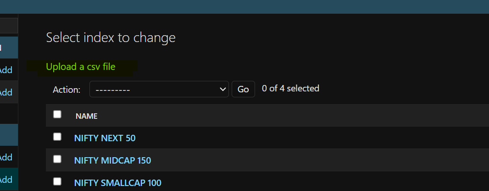
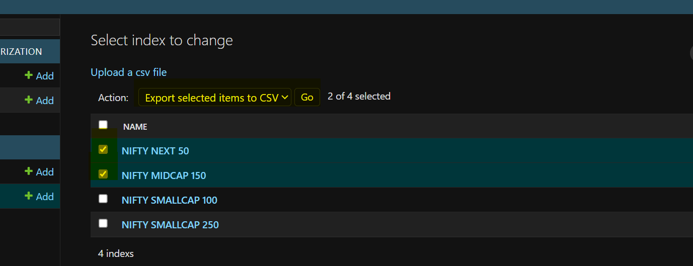
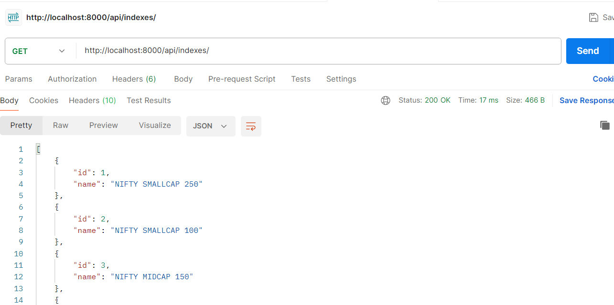
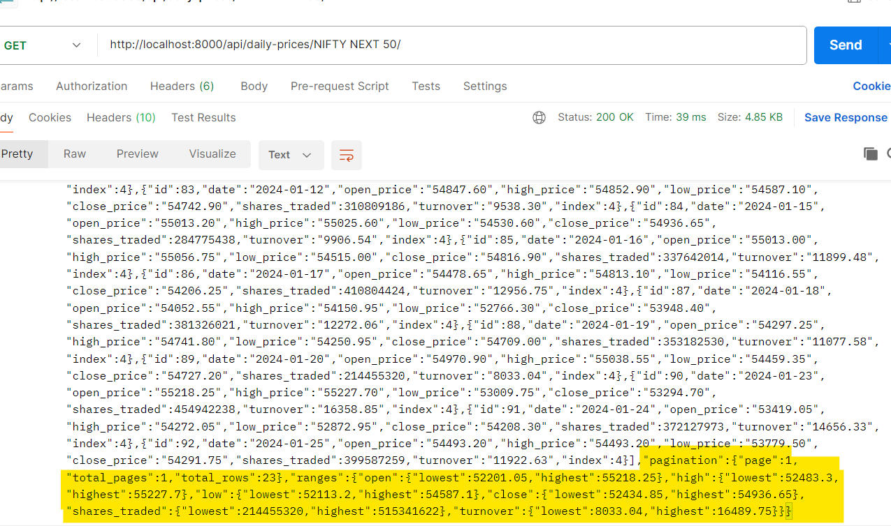
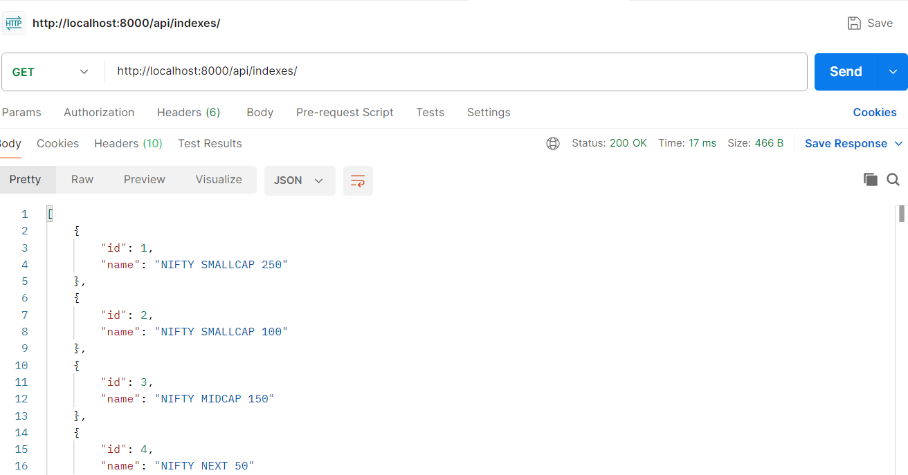
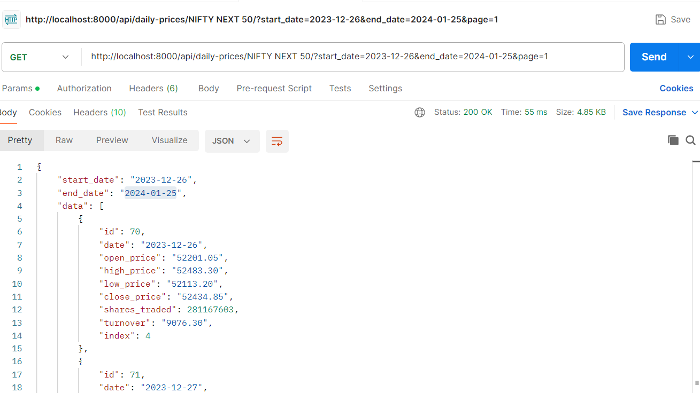

## Setup Environment and Insatll Dependencies:

### Install virtual enviournment
>`pip install virtualenv`

>https://www.geeksforgeeks.org/python-virtual-environment/

#### Create virtual envoiurnment

```python -m venv <env_name>```

or
    
>/usr/bin/python -m venv env
>>Ex: python -m venv env
  
#### Activate virtual envoiurnment

```source <env_name>/bin/activate```
>Ex: source env/bin/activate

  

#### Install requirements / Dependencies


>`pip install --upgrade pip`
> 
>`pip install -r requirements.txt`


## Check if any grc or grpcio issue occur

	python -m pip install grpcio

>https://grpc.io/docs/languages/python/quickstart/


## Database Installation


**MySQL Installation**

>https://www.digitalocean.com/community/tutorials/how-to-install-mysql-on-ubuntu-18-04

  
## Create DB Tables:

>`python manage.py makemigrations`
> 
`python manage.py migrate`

## Run Server:

>`python manage.py runserver`
> 
>OR
> 
>`python manage.py runserver host:port`


## some point 

	
	You can upload only one file at a time( Also, the file format is Fixed). And download multiple files.
		1. Upload - Click on indexes, after that, you get the upload CSV file option click on it and upload the file. If the file is not uploaded successfully it will redirect you to some other URL(for now it's some other web page URL)
		
		2. Download - Go to inside Indexes. Select files whatever you want to download. And inside action select 'Export selected item to CSV' and hit on Go . And file will start downloading
		
		
		
	
	API response -
	1. http://localhost:8000/api/indexes/ (GET API) - fetch 5 index details.
	
	2. response
	
	3. Fetch prices for index - 
		1. http://localhost:8000/api/daily-prices/<index_name>/
			i. 
		2. Specific date - http://localhost:8000/api/daily-prices/<NIFTY 50>/?specific_date=<2024-01-01>
		3. Pages - http://localhost:8000/api/daily-prices/<NIFTY_50>/?page=<3>
		4.  Date Range - http://localhost:8000/api/daily-prices/NIFTY 50/?start_date=<2024-01-01>&end_date=<2024-01-02>
		5. http://localhost:8000/api/daily-prices/NIFTY 50/?open_price=<21365>
        6. http://localhost:8000/api/daily-prices/<NIFTY_50>/?page=<3>&start_date=<2024-01-01>&end_date=<2024-01-02>
		


		
